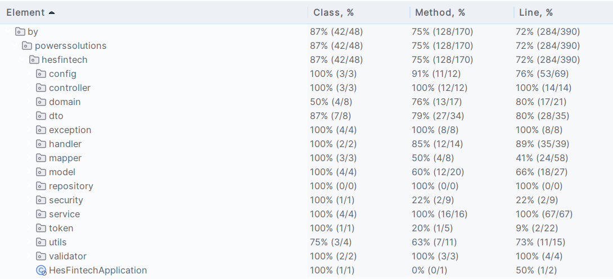

<h1 align="center">Сервис "Управление счетом"</h1>

<details>
 <summary><strong>
  Техническое задание
</strong></summary>

## ЗАДАНИЕ:

### Разработать WEB приложение "Управление счетом"

Требования:

У приложения должно быть 2 роли.
Администратор - пользователь, который может блокировать и разблокировать счет.
Владелец счета - пользователь, у которого есть доступ к своему счету и который может снять со счета деньги и положить на
счет деньги.

1. Администратор логинится в приложение и видит список всех счетов.
   Имеет возможность блокировать счет, либо разблокировать. Больше никаких действий не совершает.
2. Пользователь. Логиниться в приложении и видит только свой счет.
   Реализовать 2 операции. Пополнение счета и снятие денег со счета.

Если счет заблокирован, то никакие операции проводиться не могут.
Количество пользователей:  минимум 1 администратор и 2 владельца счетов.
Стек технологий:

- Spring Boot,
- Spring Security,
- Hibernate,
- PostgreSQL (желательно в Docker контейнере)

Предоставить рабочий сервис, с инструкцией как локально запустить и с логинами и паролями пользователей.
</details>

<details>
 <summary><strong>
  Стек
</strong></summary>

### При разработке были использованы:

* Java 17
* Gradle
* Lombok
* Spring-boot
* Spring-Security
* Mapstruct
* PostgreSQL
* Liquibase
* Springdoc-openapi
* Junit / Assertj
* Docker

</details>

<details>
 <summary><strong>
  Запуск проекта
</strong></summary>

* Скачайте проект с gitHub:
    * https://github.com/NortinPowers/hes-fintech
* Откройте терминал или командную строку и перейдите в директорию вашего проекта
* Соберите jar-файл с помощью команды сборщика ```./gradlew clean build -x test``` (с пропуском тестов для ускорения
  сборки)
* Разверните проект в Docker используя команду ```docker-compose up```

</details>

<details>
 <summary><strong>
  Open Api
</strong></summary>

* документация доступна по адресу http://localhost:8080/documentation
* api-doc доступны по адресу http://localhost:8080/documentation/api-doc

</details>

<details>
 <summary><strong>
  Информация для тестирования сервиса
</strong></summary>

* изначально доступно три пользователя
  * администратор
    * логин: admin
    * пароль: rebel
  * пользователь
    * логин: clientA
    * пароль: rebel
  * пользователь
    * логин: clientB
    * пароль: rebel
</details>

<details>
 <summary><strong>
  Endpoints
</strong></summary>

Конечные точки подробно описаны по средствам Open Api

* __POST__ __/api/auth__ создает jwt-токен на основе полученной информации о пользователе 
* __POST__ __/api/registration__ регистрирует нового пользователя
* __POST__ __/api/user/new/account__ регистрирует счет для пользователя
* __PATH__ __/api/user/withdraw/{amount}__ снятие средств со счета пользователя
  * {amount} - количество средств для снятия
* __PATH__ __/api/user/refill/{amount}__ пополнение счета пользователя
  * {amount} - количество средств для зачисления
* __GET__ __/api/user/__ показать счет пользователя
* __PATH__ __/api/accounts/block/{id}__ блокирование счета пользователя администратором
  * {id} - идентификатор счета
* __PATH__ __/api/accounts/activate/{id}__ активация счета пользователя администратором
  * {id} - идентификатор счета
* __GET__ __/api/accounts__ показать счета всех пользователей

</details>


<details>
 <summary><strong>
  Параметры запуска
</strong></summary>

* Профайл конфигурации - dev
* Данные таблиц автоматически заполняются для тестирования API

</details>

<details>
 <summary><strong>
  База данных
</strong></summary>

* Используется база PostgreSQL
* База развернута в Docker-контейнере

</details>

<details>
 <summary><strong>
  Тесты
</strong></summary>

* Сервис - 100%
* Контроллер - 100%
* Репозиторий - 100%

<details>
<summary><strong>Скриншот покрытия</strong></summary>



</details>

</details>
